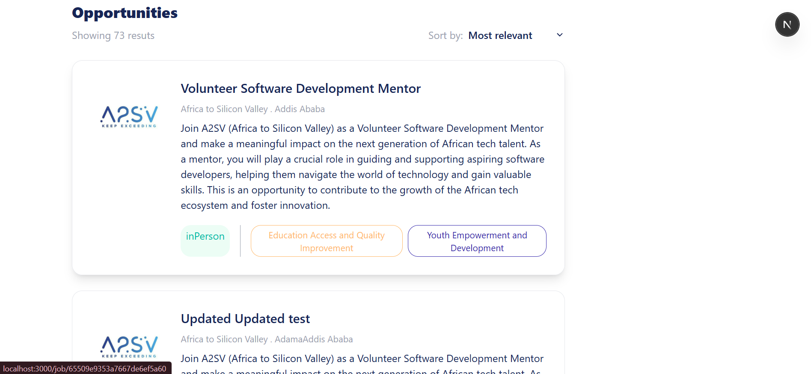
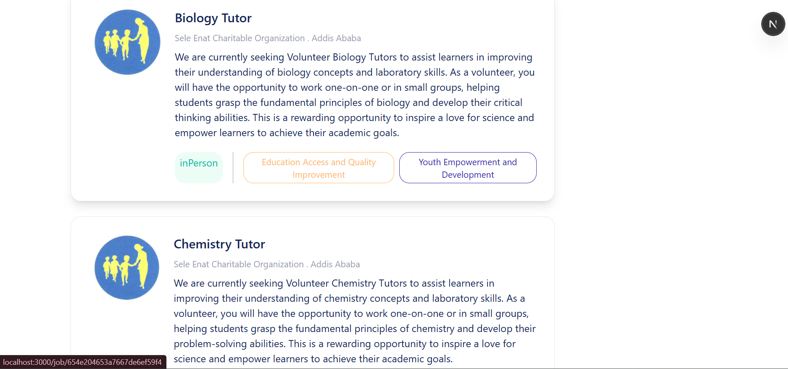
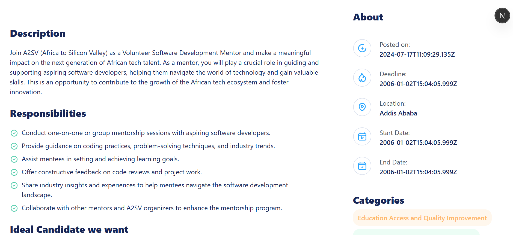
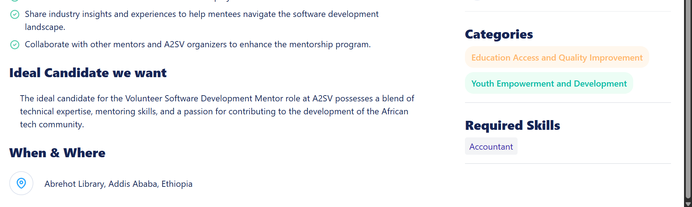
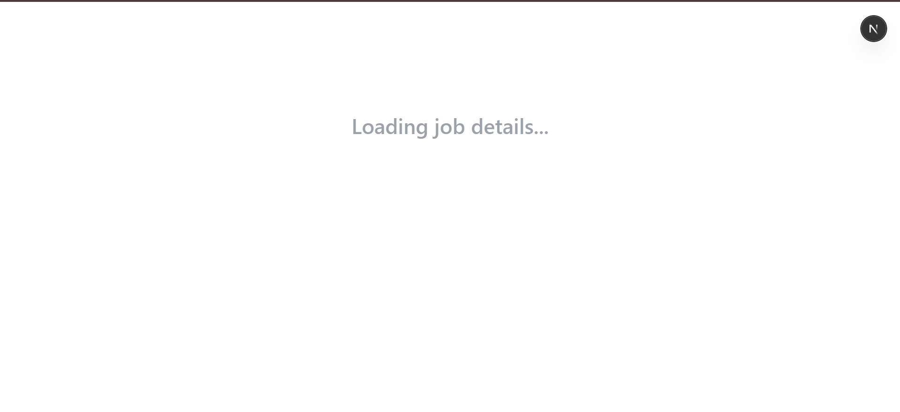
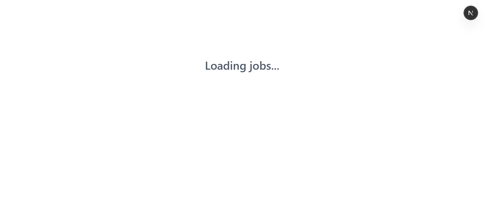
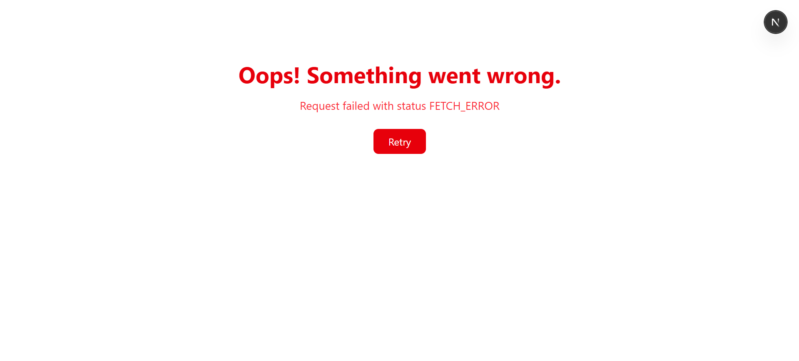

# Job Listing Application

A job listing application built with **React**, **Next.js**, **TypeScript**, and **Tailwind CSS**. It fetches real-time job opportunities from a live API and presents them through reusable components and a responsive UI.

---

## Live API Integration

- Data is fetched from:  
  `https://akil-backend.onrender.com/opportunities/search`
- Each job card and detailed page is populated dynamically using **RTK Query** and **Redux Toolkit**.

---

## Screenshots

### Job Cards

| Screenshot                                     | Description                                                      |
| ---------------------------------------------- | ---------------------------------------------------------------- |
|  | Main job card component populated with real API data.            |
|  | Multiple job listings rendered dynamically in a responsive grid. |

### Detailed Pages

| Screenshot                                       | Description                                                                   |
| ------------------------------------------------ | ----------------------------------------------------------------------------- |
|  | Detailed job page showing full description and responsibilities from the API. |
|  | Another example of a job detail view with consistent styling and layout.      |

### Loading & Error States

| Screenshot                                                 | Description                                            |
| ---------------------------------------------------------- | ------------------------------------------------------ |
|    | Loading state while fetching detailed job information. |
|  | Loading state while fetching job listings.             |
|                    | Error message displayed when data fetching fails.      |

## Features

- **API Integration** using RTK Query.
- **Dynamic Routing** for job detail pages.
- **Loading and Error Handling** with styled fallback UIs.
- **Responsive UI** using Tailwind CSS.
- **Component-Based Architecture** (JobCard, JobDetail).
- **Fallback for Missing Images** (`No Logo` placeholder).

---

## Technologies Used

- **React**
- **Next.js**
- **TypeScript**
- **Redux Toolkit + RTK Query**
- **Tailwind CSS**

---

## How to run

# 1. Clone the repository

git clone https://github.com/Kenanmen7/JoblistingTask

cd <your-project-folder>

# 2. Install dependencies

npm install

# or

yarn install

# 3. Run the development server

npm run dev

# or

yarn dev

# 4. Open in your browser

# Visit http://localhost:3000

---
